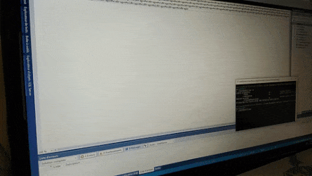

# Kanna Kamui ASCII art bleeding

[Video screen capture](https://www.youtube.com/watch?v=wzBNRHkd60c)

After seeing the Python script https://github.com/metatoaster/kanna, I wanted to make something usable outside a terminal (because Windows' terminal can't be wider than the screen that is currently on), so I've made this thing based on the metatoaster's script in C# with .NET WinForms.

## Requirements

Visual Studio 2017 to build the solution.

.NET Framework 4.5 to run the program.

## Usage

If you run it from command line, you have access to some additional options:
 - `-h` will display the help (alias `--help`)
 - `-a <file>` will use `<file>` (default `animation.json`) to load animation from (alias `--animation`)
 - `-t <seconds>` will wait `<seconds>` (default `5.0`) seconds after the end of the animation before close the window (alias `--time-before-close`)

## Credits

https://github.com/metatoaster (https://www.reddit.com/user/djrubbie) for the original Python script and animated frames.

https://www.reddit.com/user/2hu4u for the original ASCII art.
